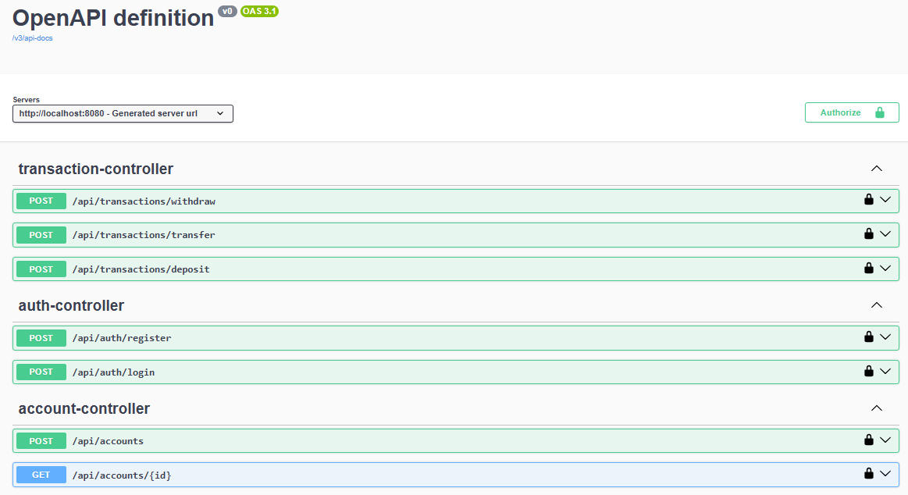

# Banking API

A RESTful Banking API built with Spring Boot.

## Architecture

```text
                +----------------------+
                |     REST Client      |
                | Swagger / HTTP       |
                +----------+-----------+
                           |
                           v
                +----------------------+
                |     Controller       |
                +----------+-----------+
                           |
                           v
                +----------------------+
                |      Service         |
                +----------+-----------+
                           |
                           v
                +----------------------+
                |    Repository        |
                +----------+-----------+
                           |
                           v
                +----------------------+
                | PostgreSQL (Docker)  |
                +----------------------+
```

## Features

- User registration
- User login with JWT authentication
- Create bank accounts
- View account details
- Deposit money
- Withdraw money
- Transfer money between accounts
- Global exception handling
- API documentation with Swagger
- Unit tests with JUnit and Mockito
- Controller tests with MockMvc
- Request validation

## Technologies

- Java 21
- Spring Boot 3
- Spring Security
- JWT (JSON Web Token)
- Spring Data JPA
- Hibernate
- PostgreSQL
- Flyway
- Maven
- Swagger / OpenAPI
- JUnit 5
- Mockito
- MockMvc
- Docker
- Docker Compose

## Project Structure

```
src
├── auth
├── account
├── transaction
├── common
└── resources
```

## API Endpoints

### Authentication

| Method | Endpoint           |
|--------|--------------------|
| POST   | /api/auth/register |
| POST   | /api/auth/login    |

### Accounts

| Method | Endpoint           |
|--------|--------------------|
| POST   | /api/accounts      |
| GET    | /api/accounts/{id} |

### Transactions

| Method | Endpoint                   |
|--------|----------------------------|
| POST   | /api/transactions/deposit  |
| POST   | /api/transactions/withdraw |
| POST   | /api/transactions/transfer |

## Authentication

Login returns a JWT token.

Example:

```text
Authorization: Bearer <your-jwt-token>
```

All protected endpoints require this header.

## Swagger

After starting the application:

```
http://localhost:8080/swagger-ui/index.html
```



## Running the application

## Run with Docker

Make sure Docker Desktop is running.

Start the application and PostgreSQL:

```bash
docker compose up --build -d
```

Check the running containers:

```bash
docker ps
```

Open Swagger UI:

```text
http://localhost:8080/swagger-ui/index.html
```

Stop the containers:

```bash
docker compose down
```

To also remove the PostgreSQL volume and all Docker database data:

```bash
docker compose down -v
```

```bash
git clone https://github.com/YOUR_GITHUB_USERNAME/BankingApi.git
cd BankingApi
./mvnw spring-boot:run
```

## Tests

Run all tests:

```bash
./mvnw test
```

The project includes:

- Unit tests with JUnit 5 and Mockito
- Controller tests with MockMvc
- Request validation tests

Current test coverage:

- **73% Line Coverage**
- **83% Method Coverage**

## Project Status

✅ Completed

Current version: **v1.0**

Implemented:

- User registration
- JWT authentication
- Account management
- Deposit
- Withdrawal
- Money transfer
- Request validation
- REST API documentation with Swagger
- Docker support
- Unit and controller tests

## Author

Marina Likhareva